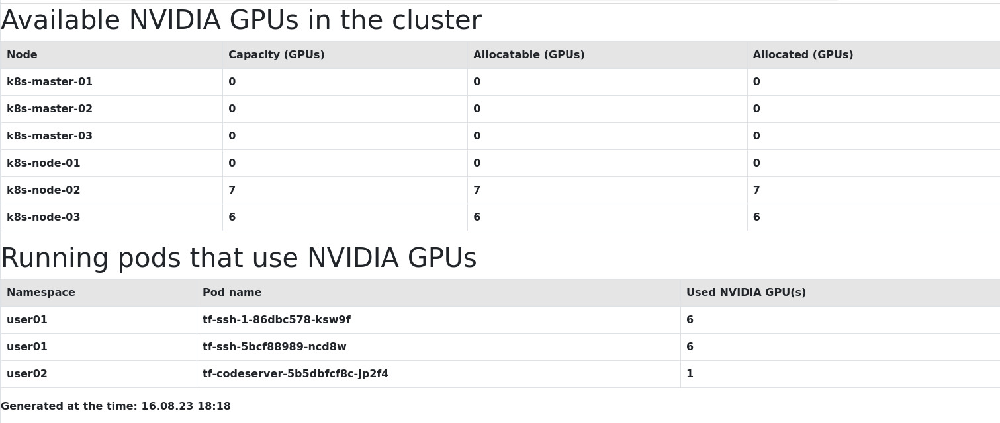

# Kubernetes GPU Usage

This web application shows the NVIDIA GPUs used in a Kubernetes cluster.

## Installation

Create a virtual environment and install all requirements there.

```sh
python3 -m venv venv;
. venv/bin/activate;
pip install --upgrade pip;
pip install -r requirements.txt;
```

## Run application

In the activated virtual environment run:
```sh
python3 app.py
```

Open in browser http://localhost:5000

## Build and run in Docker container

You can build and run this application in a Docker container if you have Docker installed.

```sh
./docker-build.sh
./docker-run.sh
```

## Running in Kubernetes

The [k8s-config/deployment.yaml](k8s-config/deployment.yaml) file contains a simple Kubernetes configuration for deploying this application as a service. You can create it by using following command:

```sh
kubectl apply -f k8s-config/deployment.yaml;
```

After you deployed it you can check if it runs by using following command:
```sh
kubectl get pods | grep k8s-gpu-usage
```
You should get an output like the following:
```
k8s-gpu-usage-6fc4655c86-swpcg           1/1     Running   0          3m46s
```
You should also check if the corresponding service has been created:
```
$ kubectl get svc k8s-gpu-usage
NAME            TYPE        CLUSTER-IP      EXTERNAL-IP   PORT(S)   AGE
k8s-gpu-usage   ClusterIP   10.233.13.163   <none>        80/TCP    6m10s
```
Then you can connect to the running service by using following command:
```sh
kubectl port-forward svc/k8s-gpu-usage 8080:80
```
Open in browser http://localhost:8080

You should see a web page like the one in the following figure:


## Running in Rancher Kubernetes UI

If you are using Rancher Kubernetes UI, you can use the Dashboard UI plugin for this application:

https://github.com/dmrub/rancher-gpu-usage-ui-plugin

## License

Copyright 2023 Dmitri Rubinstein

Licensed under the Apache License, Version 2.0 (the "License");
you may not use this file except in compliance with the License.
You may obtain a copy of the License at

[http://www.apache.org/licenses/LICENSE-2.0](http://www.apache.org/licenses/LICENSE-2.0)

Unless required by applicable law or agreed to in writing, software
distributed under the License is distributed on an "AS IS" BASIS,
WITHOUT WARRANTIES OR CONDITIONS OF ANY KIND, either express or implied.
See the License for the specific language governing permissions and
limitations under the License.
